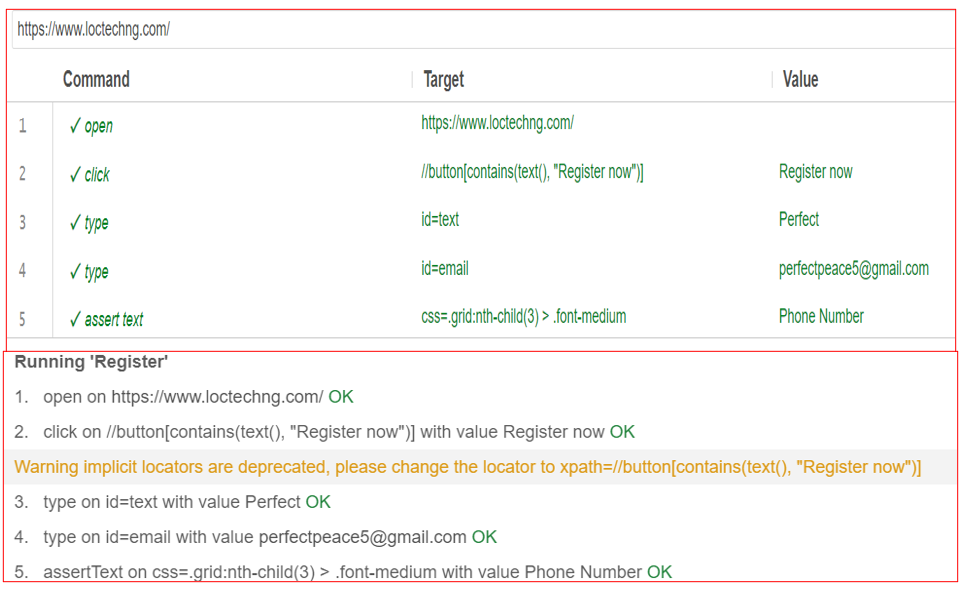

**AUTOMATION TESTING BASICS WITH SELENIUM IDE**    
Selenium IDE is a powerful tool for creating and running automated test scripts for web applications. With its user-friendly interface and record-and-playback functionality, even non-technical team members can contribute to test automation efforts. In this repository, you'll find test cases, test suites, and useful screenshots for getting started with Selenium IDE for web application testing.   
**Techniques and assertions used;**   ;
*use of variables;   
*use of XPath;   
*use of CSS selectors;   
*checking the actual presence of the element on the page;   
*checking the correctness of the element's internal text.   
*assert element not present;   
*verify not editable;   
*verify not text.

**SCREENSHOTS**    
.  

.  <br
.